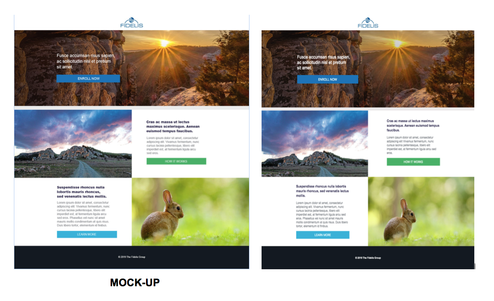

# FIDELIS

### See it live here: https://emestabillo.github.io/fidelis

Front End challenge:
1. Create a responsive HTML page based on the provided mockup
2. Webpage should be compatible with multiple browsers including support for IE11

### Tools I used:

BEM, Flexbox, CSS Grid
